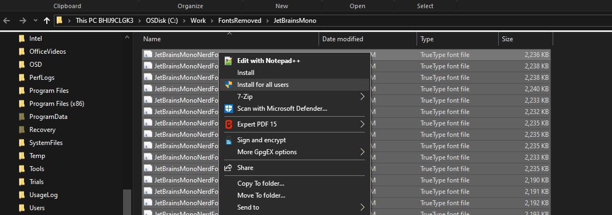
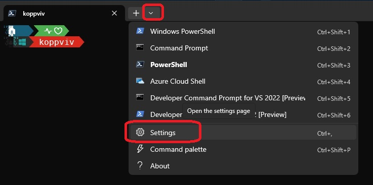
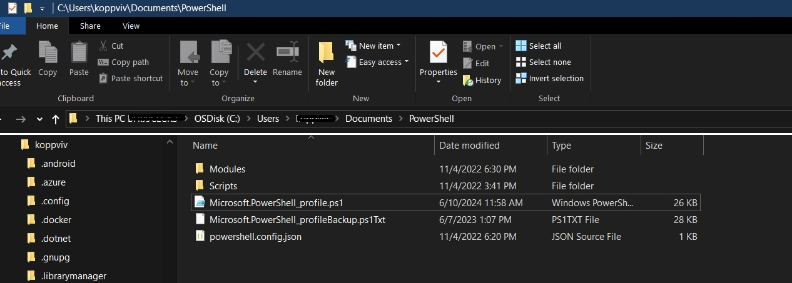
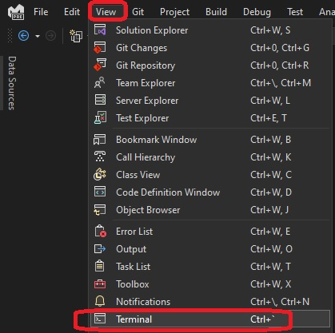
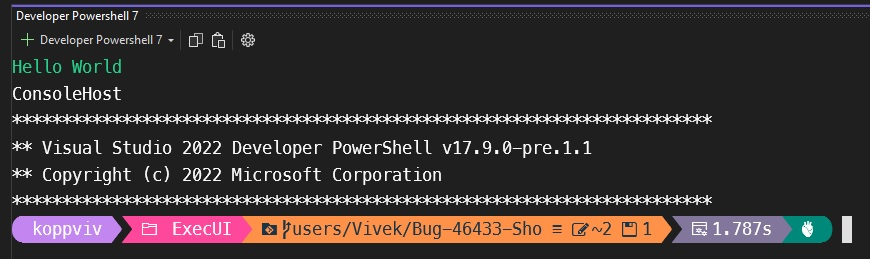
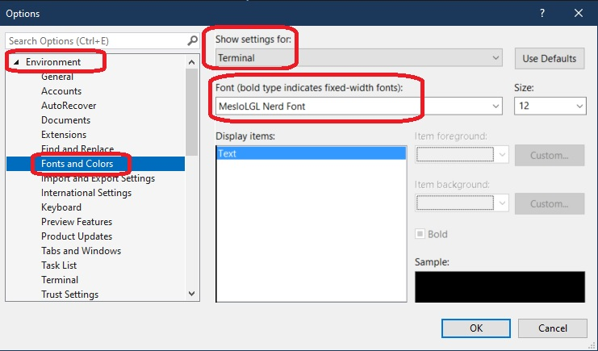

# Oh-My-Posh-Setup

Set up steps for oh my posh terminal prompt

1. [install oh-my-posh](https://ohmyposh.dev/docs/installation/windows).

   https://youtu.be/NaHgtHnOPi8?t=33

2. Verify its installed by typing Oh-My-Posh in the terminal.

3. Install the font.
   https://youtu.be/NaHgtHnOPi8?t=100

   https://www.nerdfonts.com/font-downloads
   
   You can consider the following.
   https://www.programmingfonts.org/#cascadia-code
   
   • Reserved Font Name: Cascadia Code
   • Version: 2111.01
   • Info: A fun, new monospaced font that includes programming ligatures and is designed to enhance the modern look and feel of the Windows Terminal

   https://www.programmingfonts.org/#jetbrainsmono
   
   • Version: 2.304
   • Info: JetBrains officially created font for developers

   Download the zip file of your choice, unzip, select them all and install.

4. Install zee or z
   1. https://www.hanselman.com/blog/spend-less-time-cding-around-directories-with-the-powershell-z-shortcut
   2. https://youtu.be/VT2L1SXFq9U?t=2576

5. Configure Oh-My-Posh to start up when terminal starts.
https://youtu.be/NaHgtHnOPi8?t=130

1. Create a powershell profile. Type $profile on the terminal

2. 

The profile is here.

C:\Users\YourUserName\Documents\PowerShell

Look for segments in the following.

https://ohmyposh.dev/docs/themes

## Installing windows terminal

## For Visual Studio Code, do this.

https://youtu.be/VT2L1SXFq9U?t=2021

## For Microsoft Visual Studio do the following.

To open terminal.

You have the terminal

Tool -> Options

## Fonts
1. https://ohmyposh.dev/docs/installation/fonts#installation
2. https://ohmyposh.dev/docs/installation/fonts#configuration

## References
1. Scott Hanselman Windows Terminal

2. https://www.youtube.com/watch?v=VT2L1SXFq9U

3. Take your Windows Terminal and PowerShell to the next level with Terminal Icons - Scott Hanselman's Blog
   1. https://www.hanselman.com/blog/take-your-windows-terminal-and-powershell-to-the-next-level-with-terminal-icons

4. https://youtu.be/OL9Mr4dzIWU?t=55

5. https://www.youtube.com/watch?v=FC-gLkYWXLw

6. https://stackoverflow.com/a/70536536/1977871

7. https://learn.microsoft.com/en-us/windows/terminal/tutorials/custom-prompt-setup

8. Make Windows Terminal look amazing! - Christian Lempa
   1. https://www.youtube.com/watch?v=AK2JE2YsKto

9. https://www.hanselman.com/blog/spend-less-time-cding-around-directories-with-the-powershell-z-shortcut

10. 